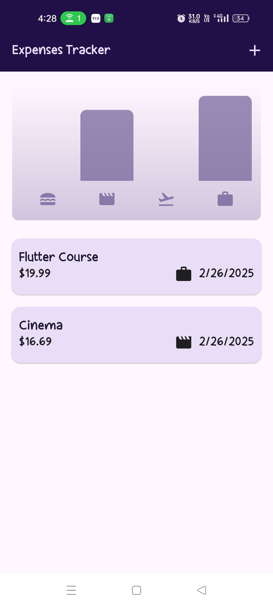
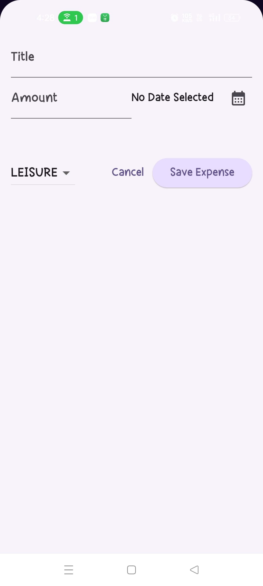
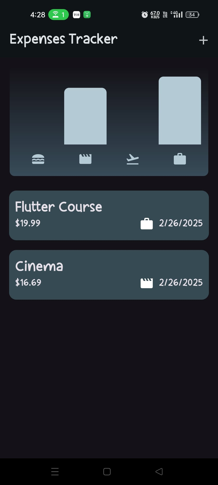
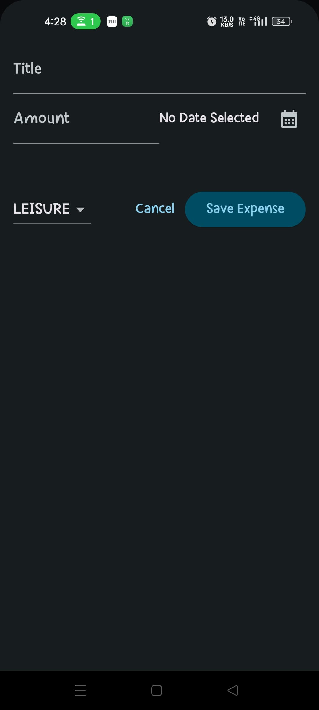

# Expense Tracker

This is a simple expense tracker application built with Flutter. It helps you manage and track your expenses efficiently.

## Features

- Add new expenses with details such as amount, category, and date.
- View a list of all expenses.
- Filter expenses by date or category.
- Visualize expenses with charts.

## Screenshots

Here are some screenshots of the app:

### Light Mode

<p align="center">
    
    
</p>

### Dark Mode

<p align="center">
    
    
</p>

## Getting Started

### Prerequisites

- Flutter SDK: [Install Flutter](https://flutter.dev/docs/get-started/install)
- Dart SDK: Included with Flutter

### Installation

1. Clone the repository:
        ```sh
        git clone git@github.com:Pratham1803/FlutterPractice.git
        ```
2. Navigate to the project directory:
        ```sh
        cd expense_tracker
        ```
3. Install dependencies:
        ```sh
        flutter pub get
        ```
4. Run the app:
        ```sh
        flutter run
        ```

## Usage

1. Open the app on your device or emulator.
2. Add your expenses by tapping the "Add Expense" button.
3. View and manage your expenses from the list.
4. Use filters to view specific expenses.
5. Check the charts for a visual representation of your expenses.

## Contributing

Contributions are welcome! Please fork the repository and create a pull request with your changes.

## License

This project is licensed under the MIT License - see the [LICENSE](LICENSE) file for details.

## Contact

For any questions or feedback, please contact [yourname](mailto:youremail@example.com).
